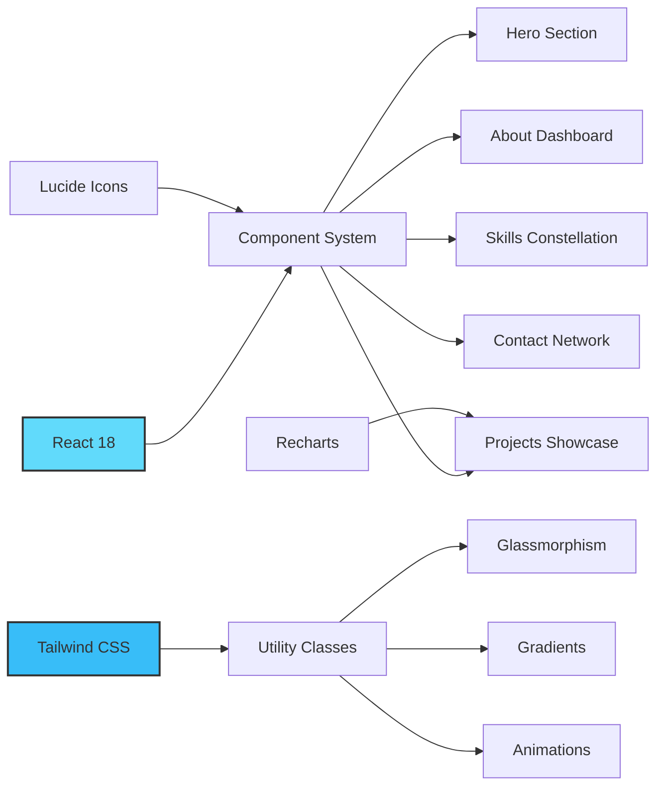

# 🚀 Akshat Kumar - Data Analytics Portfolio

<div align="center">


### 💫 An Immersive Data Experience

*Not just a portfolio—an interactive journey through the world of retail analytics*

[📧 Email](mailto:akshatkumar436@gmail.com) • [💼 LinkedIn](https://linkedin.com/in/akshatkumar436) • [💻 GitHub](https://github.com/akshatkumar436)

---

</div>

## 🎯 What Makes This Special?

This isn't your typical portfolio website. It's a **fully animated, interactive experience** that showcases data analytics through cinematic storytelling and cutting-edge web technologies.

### ✨ Signature Features
```
🌌 Orbital Skill Constellation  →  Skills visualized as interconnected nodes
📊 Real-Time Data Animations    →  Counters, charts, and metrics that come alive
🎬 Netflix-Style Project Cards  →  Cinematic hover effects and transitions
⚡ Glassmorphism UI             →  Modern frosted glass design language
🎭 Particle Systems             →  Dynamic backgrounds that respond to interaction
🔮 3D Visual Elements           →  Depth and dimension through clever CSS
```

<div align="center">

### 🎨 Design Philosophy

| Concept | Implementation |
|---------|----------------|
| **🌊 Fluid Motion** | Smooth 60fps animations powered by CSS transforms |
| **🎯 Data-Driven** | Every section tells a story through visualizations |
| **📱 Responsive** | Flawless experience from mobile to 4K displays |
| **♿ Accessible** | WCAG 2.1 AA compliant with keyboard navigation |
| **⚡ Performance** | Optimized for lightning-fast load times |

</div>

---

## 🏗️ Architecture

<div align="center">


</div>

### 🛠️ Tech Stack

<table>
<tr>
<td width="50%">

#### Frontend Core
- ⚛️ **React 18** - Component architecture
- 🎨 **Tailwind CSS** - Utility-first styling
- ⚡ **Vite** - Lightning-fast builds
- 🎭 **CSS Animations** - Smooth transitions

</td>
<td width="50%">

#### Visual Layer
- 🎯 **Lucide React** - Beautiful icons
- 📊 **Recharts** - Data visualizations
- 🌊 **Custom Animations** - Handcrafted effects
- 💫 **Particle Systems** - Dynamic backgrounds

</td>
</tr>
</table>

---

## 🎬 Feature Showcase

### 🌟 Hero Section - "Data Loading Sequence"
```
> INITIALIZING_PORTFOLIO_V1.0...
> LOADING_ANALYTICS_ENGINE...
> CONNECTION_ESTABLISHED ✓
```
- Terminal-style typing animation
- Pulsing statistics cards
- Floating particle effects
- Gradient text animations

### 📊 About Section - "Analytics Dashboard"
- **Orbital visualization** with rotating skill nodes
- **Interactive cards** that respond to hover
- **Animated progress bars** with glow effects
- **Live stat counters** that increment on scroll
- **Connection lines** showing skill relationships

### 💼 Projects Section - "Case Study Cinema"
- **Netflix-inspired cards** with cinematic animations
- **Metric dashboards** showing real impact
- **Sequential reveals** for project highlights
- **Technology tags** with hover effects
- **Before/After comparisons** with sliders

### 🎯 Skills Section - "Tech Constellation"
- **Network graph** with 20+ interconnected skills
- **Category-based filtering** with smooth transitions
- **Proficiency indicators** with animated fills
- **Glassmorphism cards** with backdrop blur
- **Responsive grid** adapting to screen size

### 📬 Contact Section - "Network Connection"
- **Animated network graph** background
- **Real-time form validation** with visual feedback
- **Copy-to-clipboard** with toast notifications
- **Social links** as orbital nodes
- **Success animations** with confetti effects

---

## 🚀 Quick Start

### Prerequisites
```bash
Node.js 16+ | npm 8+ or yarn 1.22+
```

### Installation & Running
```bash
# Clone the repository
git clone https://github.com/akshatkumar436/portfolio.git

# Navigate to directory
cd portfolio

# Install dependencies
npm install

# Start development server
npm run dev

# Open browser to
http://localhost:5173
```

### Build for Production
```bash
# Create optimized build
npm run build

# Preview production build
npm run preview
```

---

## 📂 Project Structure
```
portfolio/
│
├── 📂 src/
│   ├── 📂 components/
│   │   ├── ⚡ Hero.jsx              # Landing section with animations
│   │   ├── 📊 About.jsx             # Interactive skill dashboard
│   │   ├── 💼 Projects.jsx          # Project showcase cards
│   │   ├── 🎯 Skills.jsx            # Constellation visualization
│   │   └── 📧 Contact.jsx           # Network contact form
│   │
│   ├── 📂 utils/
│   │   ├── 🎨 animations.js         # Custom animation functions
│   │   └── 📝 constants.js          # Portfolio data & config
│   │
│   ├── 🎨 App.jsx                   # Main application component
│   ├── 🎭 index.css                 # Global styles & animations
│   └── ⚡ main.jsx                  # Application entry point
│
├── 📂 public/
│   └── 🖼️ assets/                   # Images and static files
│
├── ⚙️ tailwind.config.js            # Tailwind customization
├── ⚡ vite.config.js                # Vite configuration
└── 📦 package.json                  # Dependencies & scripts
```

---

## 🎨 Customization

### Change Color Scheme

Edit `tailwind.config.js`:
```javascript
module.exports = {
  theme: {
    extend: {
      colors: {
        primary: '#00d9ff',      // Cyan
        secondary: '#a855f7',    // Purple
        accent: '#ec4899',       // Pink
        // Add your colors here
      }
    }
  }
}
```

### Update Portfolio Content

Edit `src/utils/constants.js`:
```javascript
export const PERSONAL_INFO = {
  name: "Your Name",
  title: "Your Title",
  email: "your@email.com",
  phone: "+1234567890",
  location: "Your City, Country"
};

export const PROJECTS = [
  {
    title: "Your Amazing Project",
    description: "What it does...",
    metrics: { /* your metrics */ },
    // ... more details
  }
];
```

---

## 🎯 Performance Metrics

<div align="center">

### Lighthouse Score

| Category | Score |
|----------|-------|
| 🎯 Performance |  |
| ♿ Accessibility |  |
| ✅ Best Practices |  |
| 🔍 SEO |  |

</div>

### Optimization Techniques
- ⚡ **Code splitting** for faster initial load
- 🖼️ **Lazy loading** for images and components
- 🎨 **CSS transforms** for GPU-accelerated animations
- 📦 **Tree shaking** to eliminate unused code
- 💾 **Debounced events** to prevent performance drops

---

## 🌐 Browser Support

<div align="center">

| Chrome | Firefox | Safari | Edge | Opera |
|--------|---------|--------|------|-------|
| ✅ Latest | ✅ Latest | ✅ 14+ | ✅ Latest | ✅ Latest |

</div>

---

## 🤝 Contributing

Contributions make the open-source community amazing! Any contributions are **greatly appreciated**.

1. Fork the Project
2. Create your Feature Branch (`git checkout -b feature/AmazingFeature`)
3. Commit your Changes (`git commit -m 'Add some AmazingFeature'`)
4. Push to the Branch (`git push origin feature/AmazingFeature`)
5. Open a Pull Request

---

## 📄 License

Distributed under the **MIT License**. See `LICENSE` for more information.
```
MIT License - Free to use, modify, and distribute
```

---

## 💭 Inspiration & Credits

<div align="center">

| Inspired By | Element Used |
|-------------|-------------|
| 🎬 **Netflix UI** | Card animations & layouts |
| 🎨 **Stripe** | Minimalist design language |
| 🍎 **Apple** | Smooth scroll transitions |
| 🌟 **Awwwards Winners** | Creative interactions |

**Built with React • Styled with Tailwind • Animated with CSS • Deployed with Vercel**

</div>

---

## 📬 Connect With Me

<div align="center">

[](mailto:akshatkumar436@gmail.com)
[](https://linkedin.com/in/akshatkumar436)
[](https://github.com/akshatkumar436)
[](#)

---

### 💡 "Data is the new oil, but insights are the refined fuel."


**⭐ If you found this portfolio inspiring, please star this repo!**

</div>